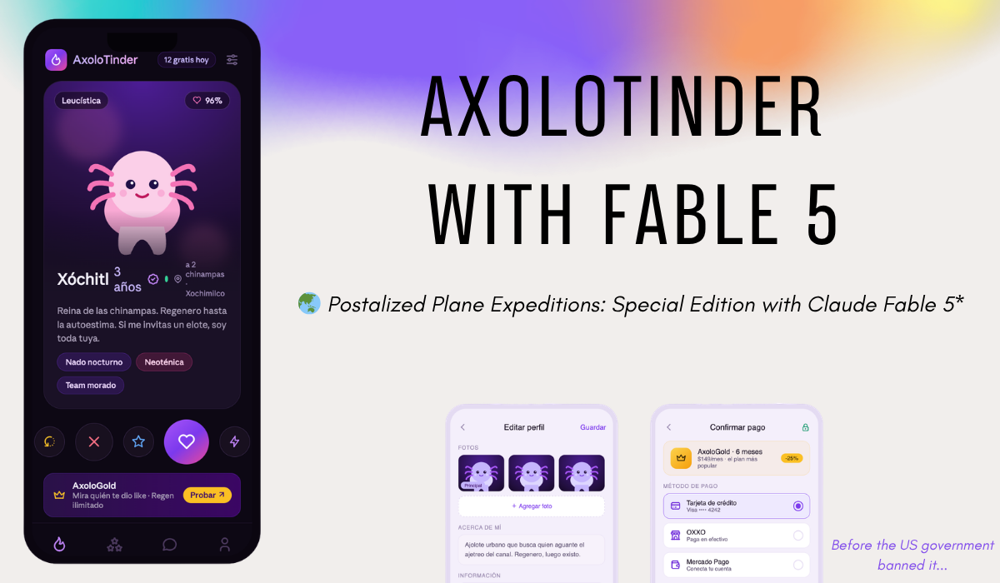

# AxoloTinder

**Regenerate your love life. / Regenera tu vida amorosa.**

Mexico City's axolotl-native dating app. Every match helps restore Xochimilco.

Purple, pink, black. Dark-first, inspired by the [Obsidian brand](https://obsidian.md/brand) and the colors Mexico City painted on itself in 2026.

---

## Read the launch

Postalized Plane Special Edition: **AxoloTinder with Fable 5**

- LinkedIn: [AxoloTinder with Fable 5](https://www.linkedin.com/pulse/axolotinder-fable5-cesar-castanon-a-p3v6e/)
- Substack: [Postalized Plane special edition](https://substack.com/home/post/p-201836363)
- X: [@castacu0 launch thread](https://x.com/castacu0/status/2065673264341344309?s=20)
- Live prototype: [castacu0.github.io/axolotinder](https://castacu0.github.io/axolotinder/)

---

## What it is

AxoloTinder is a concept dating app built around Mexico City's most iconic resident: the axolotl. Swipe through a cast of six real axolotl morphs, match on an *Ajolotímetro* compatibility score, chat with axolotl-flavored icebreakers, and upgrade to **AxoloGold** for the perks every dating app sells (see who liked you, unlimited rewinds, weekly super-likes).

The twist that makes it more than a gimmick is the pledge: **1 match = 1 peso to Xochimilco habitat restoration.**

## Why now: Ajolotización

In 2026, CDMX painted itself purple. The city's *ajolotización* campaign covered bridges, crosswalks, and Light Rail stations with pink-and-purple axolotl murals ahead of the FIFA World Cup. The local government frames the axolotl as a symbol of resilience and rebirth, and the purple as the color of the women's movement.

AxoloTinder rides that cultural moment with the same symbol and the same palette. The catch the project takes seriously: the image is booming while the real species is nearly gone from the wild in Xochimilco. That paradox is the reason the conservation pledge exists.

Context and reporting:
- Este País — [la "ajolotización" de la CDMX](https://estepais.com/tendencias_y_opiniones/ciudad-para-ser-vista-ajolotizacion-cdmx-treinta-dias-mundial/)
- Sopitas — [ajolotes y el color morado](https://www.sopitas.com/noticias/politica-imagen-ajolotes-color-morado-cdmx-significado-criticas/)
- El Heraldo de México — [ajolotización y rescate en Xochimilco](https://heraldodemexico.com.mx/nacional/2026/5/30/ajolotizacion-en-cdmx-tambien-conquista-pinatas-mientras-anuncian-rescate-de-su-habitat-en-xochimilco-822367.html)

## The cast

| Name | Morph (real axolotl color) | Vibe |
|---|---|---|
| Xóchitl | Leucistic (pink-white) | Reina de las chinampas |
| Axolfredo | Wild type (dark olive) | Café y directo |
| Doña Chela | Melanoid (black) | Sabia y sin filtros |
| Goldo | Golden albino | Brillo sin estrés |
| Frida Kahlolote | Copper | Arte y carácter |
| Glowberto | GFP fluorescent | Brilla en la oscuridad |

## Screens

Open in any browser:

- `mockups/splash-onboarding.html` — splash, welcome slides, and phone/email login (interactive flow).
- `mockups/prototype.html` — Edit profile and the AxoloGold checkout, with a working **dark / light toggle**.
- `mockups/app-screens.html` — the full app board: AxoloGold plans, swipe deck, likes-you grid, messages, profile.
- `mockups/index.html` — gallery linking all of them.

## Mobile app (Expo + React Native)

The native iOS + Android build of these screens lives in [`mobile/`](mobile/). One TypeScript codebase, Expo Router for navigation, the same purple/pink/dark tokens, axolotls drawn in `react-native-svg`.

```bash
cd mobile
npm install
npx expo start
```

Screens: splash, onboarding/login, the four tabs (Discover, Likes You, Messages, Profile), and three modals (Edit Profile, AxoloGold paywall, Checkout). See [mobile/README.md](mobile/README.md) for the full structure.

These are front-end mockups (HTML + inline SVG, no framework, no backend). The axolotls are drawn in SVG, not stock photos.

## Design system

- Palette: purple `#7C3AED`, light purple `#C4B5FD`, pink `#EC4899` / `#F472B6`, near-black `#0D0814`, AxoloGold accent `#FBBF24`.
- Dark-first with a full light theme, swapped through scoped CSS variables (`--ax-*`).
- Type: system sans, two weights (400 / 500), sentence case.

## Status

Concept prototype. UI only. Seeking a pre-seed round and conservation partners to build the beta.

## Naming note

"AxoloTinder" is a working title. *Tinder* is a registered trademark of Match Group, so a shippable product needs an original name. Candidates: Axolove, Ajolove, Axolote, Ajóla. Treat the current name as a placeholder, not a final brand.

## Content

Launch copy lives in `/content`, English first then Spanish:
- `content/linkedin.md`
- `content/blog.md`
- `content/social.md`

## Disclaimer

Fictional concept created as a design and product exercise. Not affiliated with any government, public official, or the Tinder / Match Group brand. No real user data.
